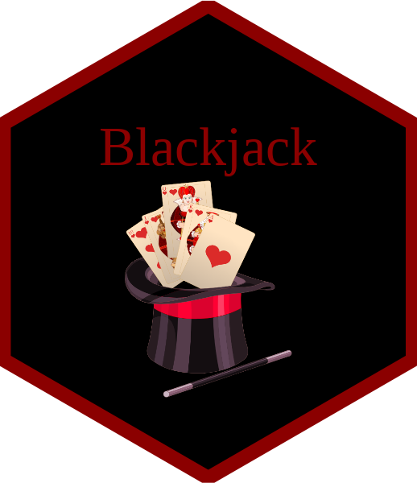

<div style="display: flex; justify-content: space-between; align-items: center;">
  <h1 style="margin: 0;">Multiplayer Blackjack Simulation</h1>
  
</div>


## Overview

The **blackjack** package provides a complete environment to simulate and play Blackjack in R.

It includes functionality for both user-controlled and automated players, allows multiplayer gameplay, and replicates realistic dealer decision-making.

## Features

-   Generate and shuffle one or more Blackjack decks
-   Deal cards and calculate the total value of each hand
-   Let players choose to hit or stand during their turn
-   Use automated player strategies based on a set score threshold
-   Simulate dealer behavior with smart rules
-   Play games with up to unlimited players against the dealer
-   Run simulations over many rounds to analyse outcomes

## Installation

This package is built for use in local development and testing environments.

``` r
# To install from your local working directory:
devtools::install()

# To load for development:
devtools::load_all()
```

## Functions

-   `create_shuffled_deck()` Creates a shuffled deck (default 4 decks combined)
-   `deal_hand()` Deals n cards and returns updated deck
-   `card_value()` Calculates total value of a hand, adjusting for Aces
-   `player_turn()` Handles interactive player decisions: hit or stand
-   `auto_player_turn()` Automated player draws until reaching a threshold
-   `dealer_turn()` Dealer draws until reaching 17 or soft 17
-   `dealer_turn_smart()` Smart dealer strategy that also compares against player score
-   `play_blackjack()` Plays one round with one interactive player and a dealer
-   `play_blackjack_multi()` Simulates one round for multiple players vs dealer (default setting is 2 players)
-   `simulation_blackjack()` Simulates multiple rounds using automated strategies (default is 1000 rounds)

## Examples

### Interactive Single Player Game

``` r
play_blackjack()
```

### Multiplayer Game (2 players vs dealer)

``` r
play_blackjack_multi()
```

### Batch Simulation

``` r
simulation_blackjack(threshold = 16, num_rounds = 1000)
```

## Authors

-   Andy Tran (cre, aut)
-   Rong Xu (aut)
-   Yiran Yao (aut)

## License

GPL (\>= 3)
